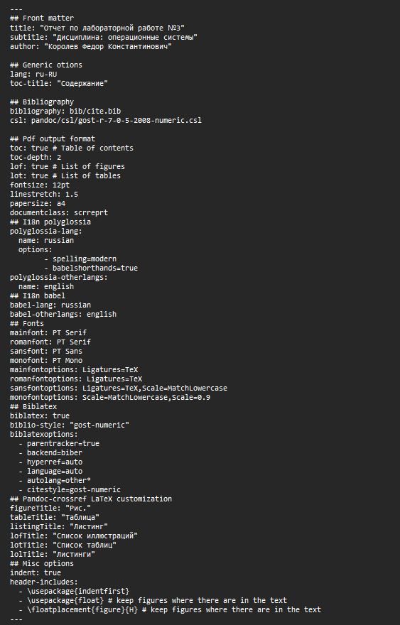
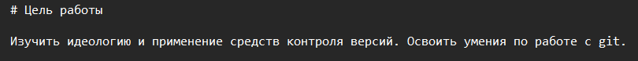
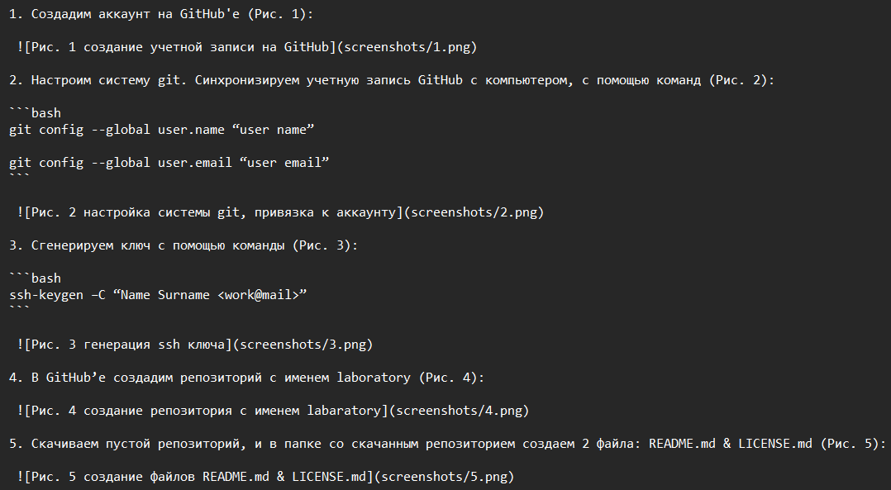

---
## Front matter
lang: ru-RU
title: Отчет по лабораторной работе №3
author: Королев Федор Константинович
institute: РУДН, Москва, Россия

date: 29.04.2022

## Formatting
toc: false
slide_level: 2
theme: metropolis
header-includes: 
 - \metroset{progressbar=frametitle,sectionpage=progressbar,numbering=fraction}
 - '\makeatletter'
 - '\beamer@ignorenonframefalse'
 - '\makeatother'
aspectratio: 43
section-titles: true
---

# Отчет по лабораторной работе №3

## Работа с MarkDown

{#fig:001 width=70%}

## Цель работы

{#fig:002}

## Ход работы

- Распишем алгоритм, опираясь на лабораторную работу №2

- Для каждого скриншота указываем полный путь

{#fig:003 width=70%}

## Создание отчета в трёх форматах

Создаём отчет в трех форматах: .md .pdf .docx.
С помощью pandoc'a.

```pandoc
pandoc report_l3.md -o report_l3.pdf
pandoc report_l3.md -o report_l3.docx
```

## Вывод

В ходе данной лабораторной работы я научился работать с .md файлами, создавать pdf и docx
