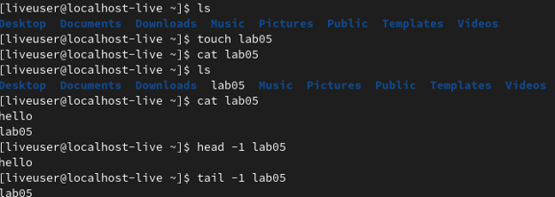
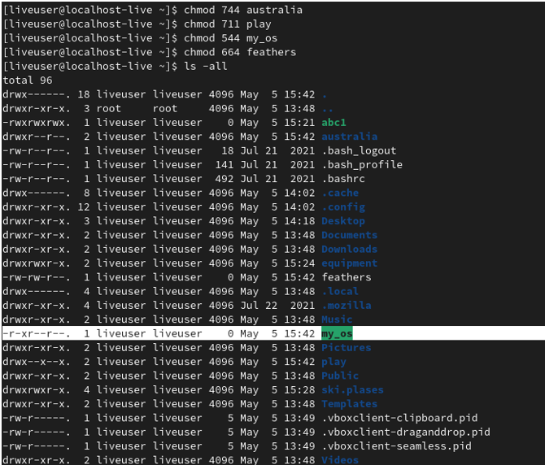
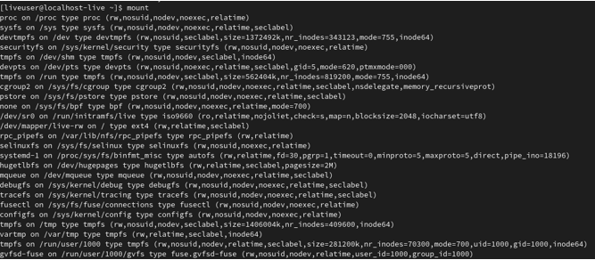

---
## Front matter
lang: ru-RU
title: Отчет по лабораторной работе №5
author: Королев Федор Константинович
institute: РУДН, Москва, Россия

date: 29.04.2022

## Formatting
toc: false
slide_level: 2
theme: metropolis
header-includes: 
 - \metroset{progressbar=frametitle,sectionpage=progressbar,numbering=fraction}
 - '\makeatletter'
 - '\beamer@ignorenonframefalse'
 - '\makeatother'
aspectratio: 43
section-titles: true
---

# Отчет по лабораторной работе №5

## Цель работы

Ознакомление с файловой системой Linux, её структурой, именами и содержанием каталогов. Приобретение практических навыков по применению команд для работы с файлами и каталогами, по управлению процессами (и работами), по проверке использования диска и обслуживанию файловой системы.

## Базовые команды терминала Unix

## Работа с правами доступа

## Ознакомление с файловой системой Unix

## Вывод

В ходе данной лабораторной работы я освоил навыки изменения прав доступа, создания, перемещения и копирования каталогов и файлов. А также узнал что такое файловая система и познакомился с некорыми новыми командами Unix.

