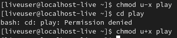
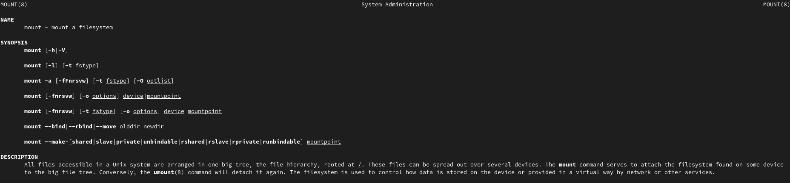

---
## Front matter
title: "Отчет по лабораторной работе №5"
subtitle: "Дисциплина: операционные системы"
author: "Королев Федор Константинович"

## Generic otions
lang: ru-RU
toc-title: "Содержание"

## Bibliography
bibliography: bib/cite.bib
csl: pandoc/csl/gost-r-7-0-5-2008-numeric.csl

## Pdf output format
toc: true # Table of contents
toc-depth: 2
lof: true # List of figures
lot: true # List of tables
fontsize: 12pt
linestretch: 1.5
papersize: a4
documentclass: scrreprt
## I18n polyglossia
polyglossia-lang:
  name: russian
  options:
	- spelling=modern
	- babelshorthands=true
polyglossia-otherlangs:
  name: english
## I18n babel
babel-lang: russian
babel-otherlangs: english
## Fonts
mainfont: PT Serif
romanfont: PT Serif
sansfont: PT Sans
monofont: PT Mono
mainfontoptions: Ligatures=TeX
romanfontoptions: Ligatures=TeX
sansfontoptions: Ligatures=TeX,Scale=MatchLowercase
monofontoptions: Scale=MatchLowercase,Scale=0.9
## Biblatex
biblatex: true
biblio-style: "gost-numeric"
biblatexoptions:
  - parentracker=true
  - backend=biber
  - hyperref=auto
  - language=auto
  - autolang=other*
  - citestyle=gost-numeric
## Pandoc-crossref LaTeX customization
figureTitle: "Рис."
tableTitle: "Таблица"
listingTitle: "Листинг"
lofTitle: "Список иллюстраций"
lotTitle: "Список таблиц"
lolTitle: "Листинги"
## Misc options
indent: true
header-includes:
  - \usepackage{indentfirst}
  - \usepackage{float} # keep figures where there are in the text
  - \floatplacement{figure}{H} # keep figures where there are in the text
---

# Цель работы 

Ознакомление с файловой системой Linux, её структурой, именами и содержанием каталогов. Приобретение практических навыков по применению команд для работы с файлами и каталогами, по управлению процессами (и работами), по проверке использования диска и обслуживанию файловой системы.

# Ход работы

1. Повторим действия приведенные в пункте 1:

- Работа с файлами: просмотр содержимого и создание файлов(Рис. 1):

- Копирование файлов и каталогов(Рис. 2):

- Перемещение и переименование файлов и каталогов(Рис. 3):

- Изменение и просмотр прав доступа(Рис. 4 и 5):

Как видно, владелец файла имеет право на чтение и запись, группа, в которую входит владелец, также, имеет право на чтение и запись, все остальные могут читать файл.

- Анализ файловой системы(Рис. 6):

2.1. Скопируем файл /usr/include/sys/io.h в домашний каталог с именем equipment(Рис. 7):

2.2 и 2.3. Создадим директорию ski.plases в домашнем каталоге и переместим файл equipment в созданную директорию(Рис. 8):

2.4. Переименуем файл ski.plases/equipment в ski.plases/equiplist(Рис. 9):

2.5. Создание файла abc1 и копирование его в папку ski.plases с именем equiplist2(Рис. 10):

2.6 и 2.7. в папке ski.plases создадим папку equipment и переместим файлы equiplist и equiplist2 в новую директорию(Рис. 11):

2.8. В домашней папке создадим директорию newdir и перенесем её в папку ski.plases и изменим имя на plans(Рис. 12):

3. Права доступа:

 Создаём соответствующие файлы(Рис. 13):

 

 3.1. drwxr--r-- 744 australia

 3.2. drwx--x--x 711 play

 3.3. -r-xr--r-- 544 my_os

 3.4. -rw-rw-r-- 664 feathers

 Устанавливаем соответствующие права доступа(Рис. 14):

 

4.1. Просмотрим содержимое файла /etc/passwd, т.к. password не существует(Рис. 15):

 

4.2-4.5. скопируем файл feathers в файл file.old. Переместим файл file.old в каталог play. Скопируем каталог play в каталог fun. Переместим каталог fun в каталог Play и назовем его games(Рис. 16):

 

4.6-4.9. Лишим владельца файла feathers права на чтение. При попытке просмотреть файл с помощью команды cat запрос отклонен, т.к. нет права доступа. При попытке копирование запрос будет отклонен, т.к. нет права доступа на запись. Дадим владельцу файла feathers право на чтение(Рис. 17):

 

4.10-4.12. Лишим владельца каталога play права на выполнение. Попробуем перейти в каталог play - запрос отклонен, т.к. нет права на исполнение. Обратно дадим право на исполнение(Рис. 18):

 

5. Описание с помощью man:

 - mount применяется для монтирования и просмотра файловых систем(Рис. 19):

  

 - fsck применяется для проверки и исправления ошибок файловой системы(Рис. 20):

  

 - kill прерывает работу программы(Рис. 21):

   

 - mkfs применяется для создания файловой системы(Рис. 22):

  

# Контрольные вопросы 

1). Командная строка – специальная  программа, позволяющая  управлять операционной  системой  при  помощи  текстовых  команд,  вводимых  в окне приложения.
2). Для определения абсолютного пути к текущему каталогу используется команда  pwd  (print  working  directory). Например,  команда  «pwd»  в моем домашнем каталоге выведет: /home/tbkonovalova
3). Команда  «ls-F» (или  «ls-aF»,  тогда  появятся  еще  скрытые  файлы) выведет имена файлов в текущем каталоге и их типы. Тип каталога обозначается /, тип исполняемого файла обозначается *, тип ссылки обозначается @. Пример на Рисунке 2.
4). Имена  скрытых  файлов  начинаются  с  точки.  Эти  файлы  в операционной системе скрыты от просмотра и обычно используются для  настройки  рабочей  среды.  Для  того,  чтобы  отобразить  имена скрытых файлов, необходимо использовать команду «ls –a». Пример на Рисунке 2.
5). Команда  rm  используется  для  удаления  файлов  и/или  каталогов. Команда rm-i выдает  запрос  подтверждения  наудаление  файла. Команда rm-r необходима, чтобы удалить каталог, содержащий файлы. Без указания этой опции команда не будет выполняться. Если каталог пуст,  то  можно  воспользоваться  командой  rmdir.  Если  удаляемый каталог  содержит  файлы,  то  команда  не  будет выполнена –нужно использовать «rm -r имя_каталога».Таким  образом,  каталог,  не  содержащий  файлов,  можно  удалить  и командой rm, и командой rmdir. Файл командой rmdir удалить нельзя. Примеры на Рисунке 9.
6). Чтобы  определить,  какие  команды  выполнил  пользователь  в  сеансе работы, необходимо воспользоваться командой «history».
7). Чтобы  исправить  илизапустить  на  выполнение  команду,  которую пользователь уже использовал в сеансе работы, необходимо: в первом случае:воспользоваться конструкцией !<номер_команды>:s/<что_меняем>/<на_что_меняем>,   во   втором случае: !<номер_команды>. Примеры на Рисунке 21.
8). Чтобы записать в одной строке несколько команд, необходимо между ними поставить ; . Например, «cd /tmp; ls».
9). Символ  обратного  слэша позволяет  использовать  управляющие символы  (".",  "/",  "$",  "*",  "[",  "]",  "^",  "&")  без  их  интерпретации командной оболочкой; процедура  добавления данного  символа  перед управляющими  символами  называетсяэкранированием  символов. Например,  команда  «lsnewdir\/morefun»  отобразит  содержимое каталога newdir/morefun.
10). Команда «ls -l» отображает список каталогов и файлов с подробной информацией  о  них (тип  файла,  право  доступа, число  ссылок, владелец, размер, дата последней ревизии, имя файла или каталога).

# Вывод

В ходе данной лабораторной работы я освоил навыки изменения прав доступа, создания, перемещения и копирования каталогов и файлов. А также узнал что такое файловая система и познакомился с некорыми новыми командами Unix.

