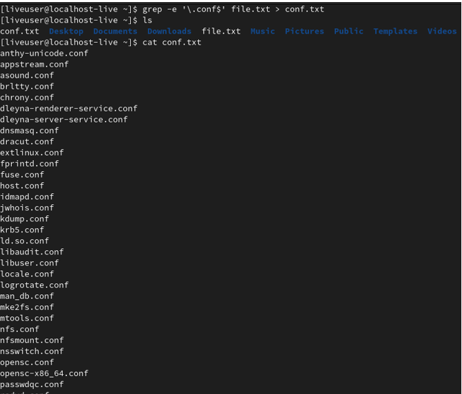

---
## Front matter
lang: ru-RU
title: Отчет по лабораторной работе №6
author: Королев Федор Константинович
institute: РУДН, Москва, Россия

date: 06.05.2022

## Formatting
toc: false
slide_level: 2
theme: metropolis
header-includes: 
 - \metroset{progressbar=frametitle,sectionpage=progressbar,numbering=fraction}
 - '\makeatletter'
 - '\beamer@ignorenonframefalse'
 - '\makeatother'
aspectratio: 43
section-titles: true
---

# Отчет по лабораторной работе №6

## Цель работы 

Ознакомление с инструментами поиска файлов и фильтрации текстовых данных. Приобретение практических навыков: по управлению процессами (и заданиями), по проверке использования диска и обслуживанию файловых систем.

## Перенаправка ввода\вывода

 

## Работа с конвейером

 

## Поиск файлов

 

## Фильтрование текста

 

## Работа с диском

 

## Вывод

В ходе данной лабораторной работы я научился перенаправлять ввод, работать с конвейером, искать файлы, фильтровать текст, а также проверять использование диска и управлять процессами, получать о них информацию.