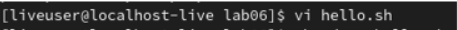
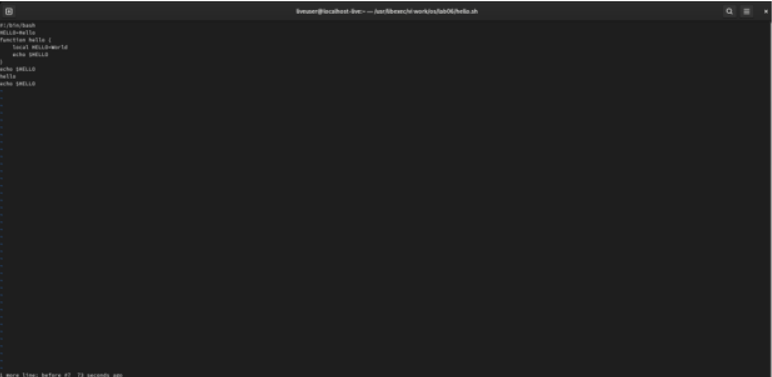

---
## Front matter
lang: ru-RU
title: Отчёт по лабораторной работе №8
author: Королев Федор Константинович
institute: РУДН, Москва, Россия

date: 13 Мая 2021

## Formatting
toc: false
slide_level: 2
theme: metropolis
header-includes: 
 - \metroset{progressbar=frametitle,sectionpage=progressbar,numbering=fraction}
 - '\makeatletter'
 - '\beamer@ignorenonframefalse'
 - '\makeatother'
aspectratio: 43
section-titles: true
---

# Отчет по лабораторной работе №7

## Открытие редактора vi

## Режимы работы

- командный режим 

- режим вставки(открывается с помощью i)

- режим последней(или командной) строки(:)

## Основные команды

- удаление - d

- вставка - o

- отмена действий - u

## Вывод

В ходе данной лабораторной работы я освоил базовые навыки работы в редакторе vi.

