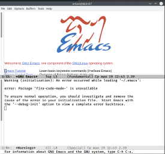
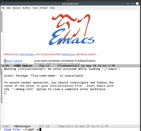
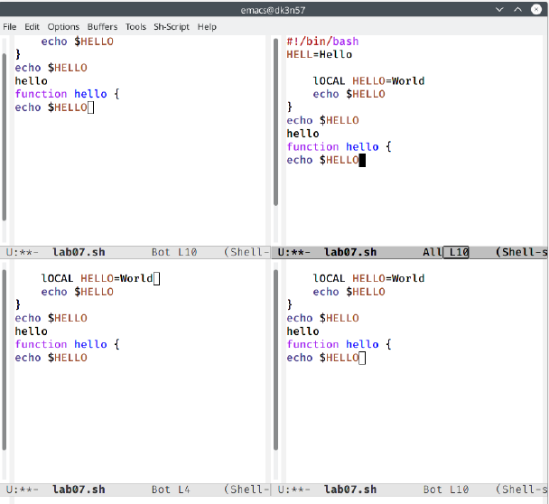
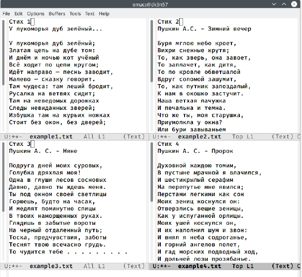

---
## Front matter
lang: ru-RU
title: Отчёт по лабораторной работе №9
author: Королев Федор Константинович
institute: РУДН, Москва, Россия

date: 21 Мая 2021

## Formatting
toc: false
slide_level: 2
theme: metropolis
header-includes: 
 - \metroset{progressbar=frametitle,sectionpage=progressbar,numbering=fraction}
 - '\makeatletter'
 - '\beamer@ignorenonframefalse'
 - '\makeatother'
aspectratio: 43
section-titles: true
---

# Презентация по лабораторной работе №9

## Редактор Emacs

Открыл редактор Emacs с помощью команды "emacs &'

## Редактор Emacs

Создал файл lab07.sh с помощью комбинации «Ctrl-x» «Ctrl-f»

## Работа с фреймом

Поделил фрейм на 4 части(команда «Ctrl-x 3»)

## Режим поиска

Переключился в режим поиска(«Ctrl-s»)

## Вывод

В ходе выволнения данной лабораторной работы я познакомился с ОС Linux и получил практические навыки работы с редактором Emacs.