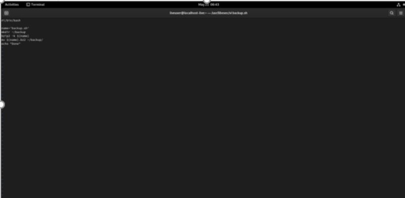
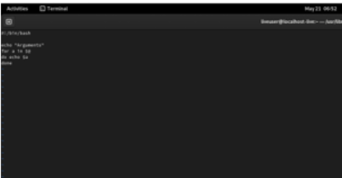
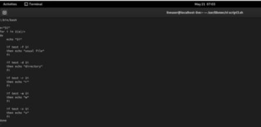
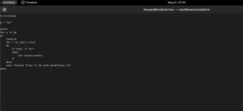

---
## Front matter
lang: ru-RU
title: Отчёт по лабораторной работе №10
author: Королев Федор Константинович
institute: РУДН, Москва, Россия

date: 21 Мая 2021

## Formatting
toc: false
slide_level: 2
theme: metropolis
header-includes: 
 - \metroset{progressbar=frametitle,sectionpage=progressbar,numbering=fraction}
 - '\makeatletter'
 - '\beamer@ignorenonframefalse'
 - '\makeatother'
aspectratio: 43
section-titles: true
---

# Презентация по лабораторной работе №10

## Первый скрипт

Программа делает резервную копию самой себя

## Второй скрипт

Обрабатывает произвольное количество чисел и выводит их

## Третий скрипт

Действие скрипта аналогично ls

## Четвертый скрипт

Скрипт получает путь и формат, а возвращает количество таких файлов

## Вывод

В ходе выполнения данной лабораторной работы я изучил основы программирования в оболочке ОС UNIX и научился писать небольшие командные файлы.