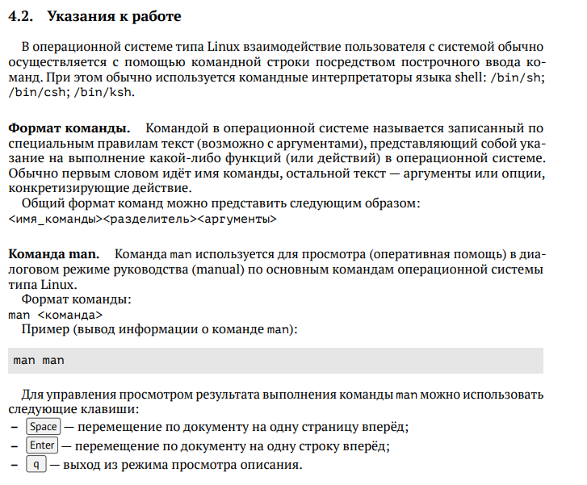
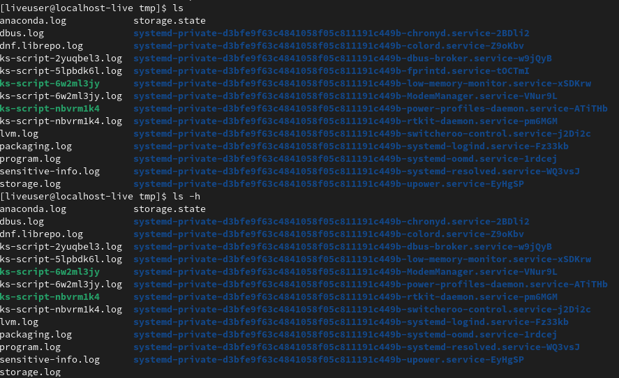

---
## Front matter
lang: ru-RU
title: Отчет по лабораторной работе №4
author: Королев Федор Константинович
institute: РУДН, Москва, Россия

date: 29.04.2022

## Formatting
toc: false
slide_level: 2
theme: metropolis
header-includes: 
 - \metroset{progressbar=frametitle,sectionpage=progressbar,numbering=fraction}
 - '\makeatletter'
 - '\beamer@ignorenonframefalse'
 - '\makeatother'
aspectratio: 43
section-titles: true
---

# Отчет по лабораторной работе №4

## Цель работы 

Приобретение практических навыков взаимодействия пользователя с системой посредством командной строки

## Ознакомление с теоретическим материалом

## Работа с консолью Linux

## Вывод

В ходе данной лабораторной работы я научился работать с начальными командами консоли Linux.

